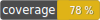

PHP mnemonic generation library for TON blockchain
---



[](https://packagist.org/packages/olifanton/mnemonic)
[](https://packagist.org/packages/olifanton/mnemonic)


---
[💬 En chat](https://t.me/olifanton_en) | [💬 Ру чат](https://t.me/olifanton_ru)

PHP port of [`tonweb-mnemonic`](https://github.com/toncenter/tonweb-mnemonic) JS library

## Install

```bash
composer require olifanton/mnemonic
```

## Docs

`@TODO`

## Tests

```bash
composer run test
```

## Contributing

Please make sure to read the [Olifanton contribution guide](https://github.com/olifanton/.github/blob/main/profile/CONTRIBUTING.md) before making a pull request.

### Setup environment

Prepare your environment for development.

Note that the instructions describe working on *nix systems (Linux and possibly macOS),
development on Windows may be difficult and will not be covered in these instructions.

You'll need:

1. Minimum PHP version: 8.1.

### Fork repository

Make a repository fork in your GitHub account.

### Clone your repository

```bash
git clone git@github.com:<YOUR_GITHUB_NAME>/mnemonic.git
cd mnemonic
```

### Create a `feature/` (or `hotfix/`) branch

```bash
git branch feature/<FEATURE_NAME>
git checkout feature/<FEATURE_NAME>
```

### Create pull request

After implementing your new feature (or hotfix) in your local branch, you should
commit and push changes to your fork repository. After that you can create a pull-request.

# License

MIT
